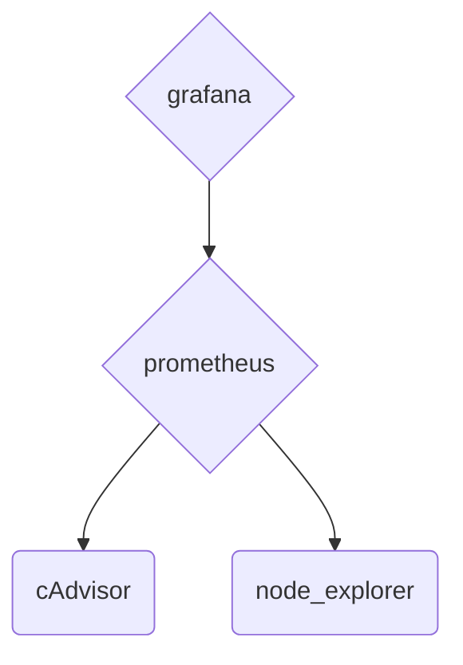

En cours de dev

# Monitoring Debian

```mermaid
graph TD
grafana{grafana}
prometheus{prometheus}
cAdvisor(cAdvisor)
node_explorer(node_explorer)

prometheus --> cAdvisor
prometheus --> node_explorer
grafana --> prometheus
```