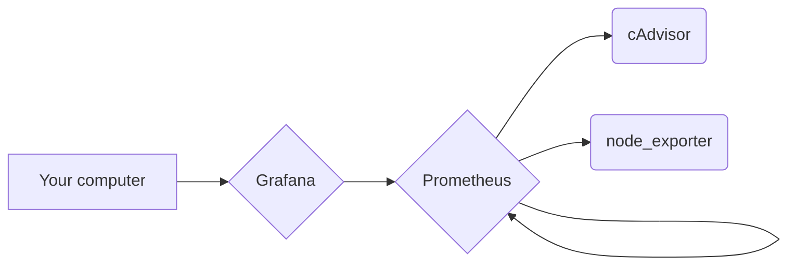

The 1.0.0 doesn't work !

# Monitoring Debian
Simple ansible and Docker stack for install [cAdvisor](https://github.com/google/cadvisor) and [node_exporter](https://github.com/prometheus/node_exporter)

## How it works

After clonning this repository, edit the __inventory__ file with the name of your servers from your ssh configuration ([like this](https://github.com/arezoomaleki/ssh-config-file/blob/main/config)), play `make install`.

Ansible gonna install docker and all dependencies needed, clone this repository on ``/srv/monitoring`` so that play the docker compose who gonna install cAdvisor, node exporter, Prometheus and Grafana.

## Architecture


## Grafana IP

``[YOUR IP]:9200``

## Grafana Panel ID

- node_exporter : `1860`
- cAdvisor : ``14282``


## Some informations

```
ansible [core 2.13.13]
python version = 3.8.10
jinja version = 3.1.2
libyaml = True
```
